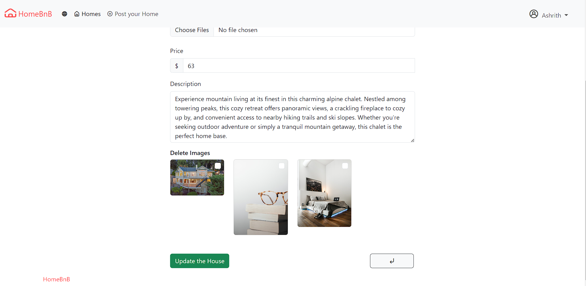
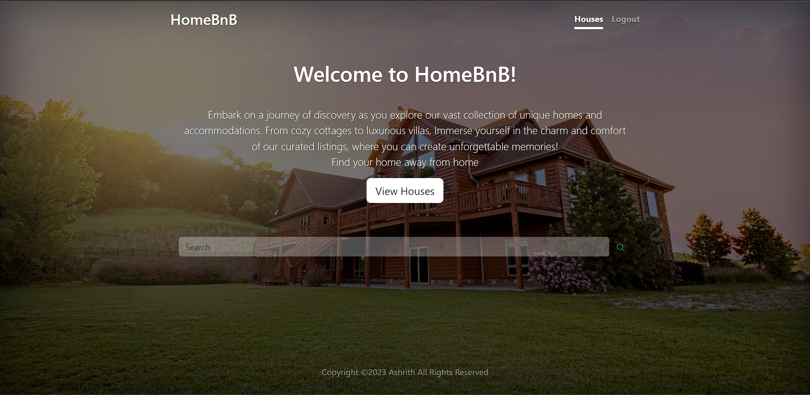
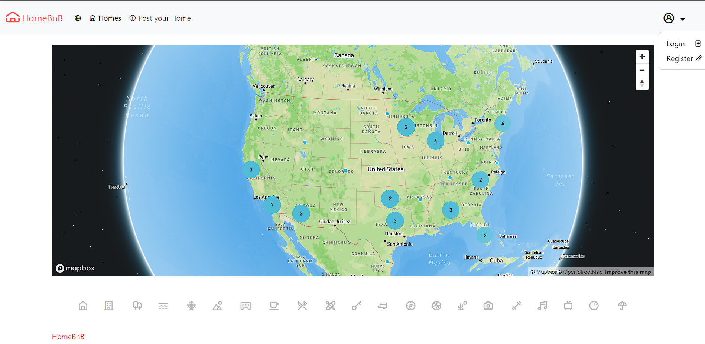
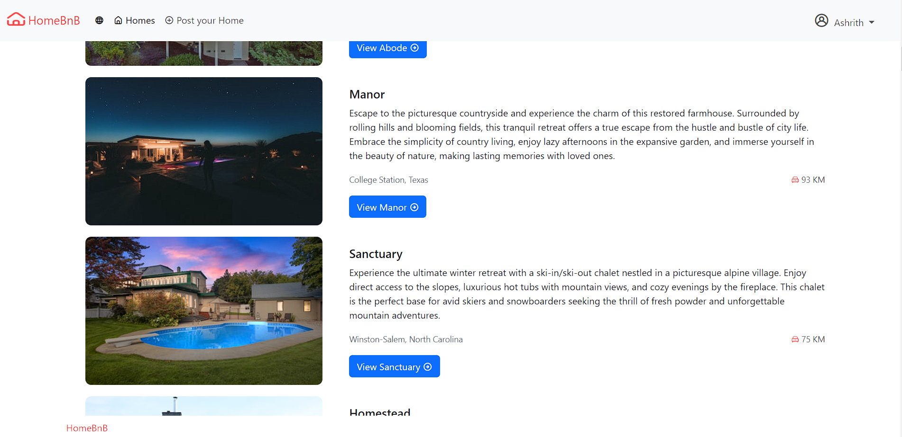
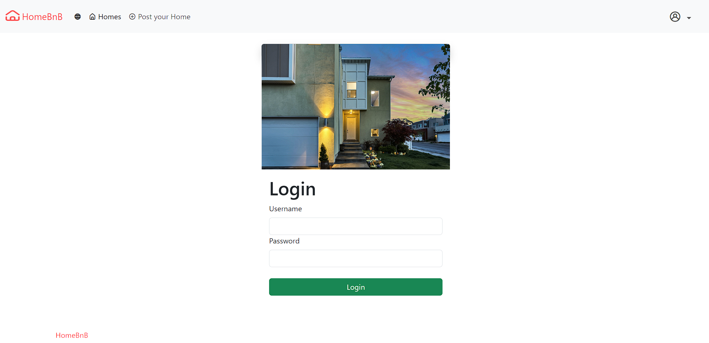
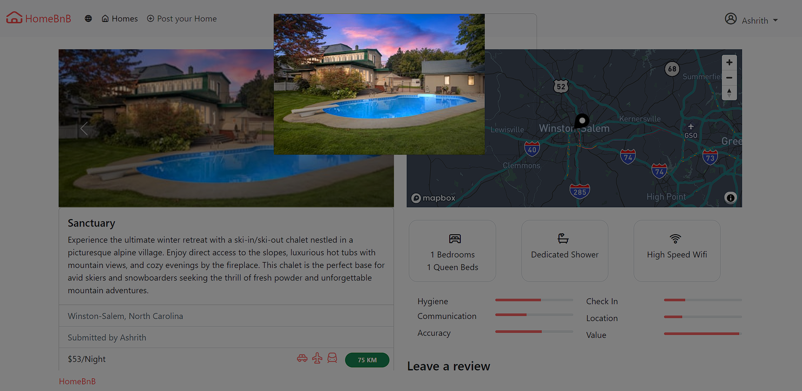
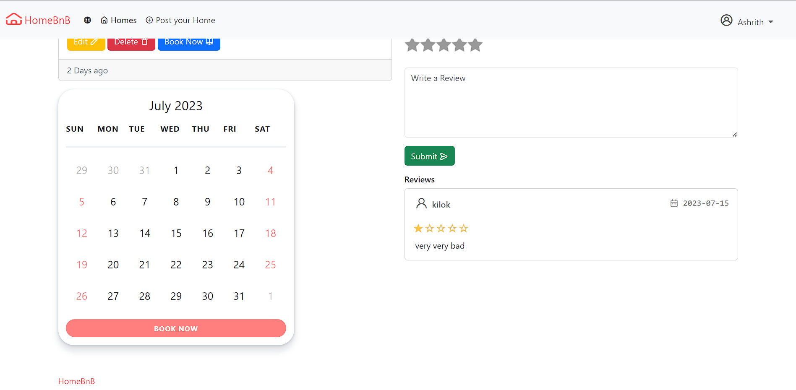
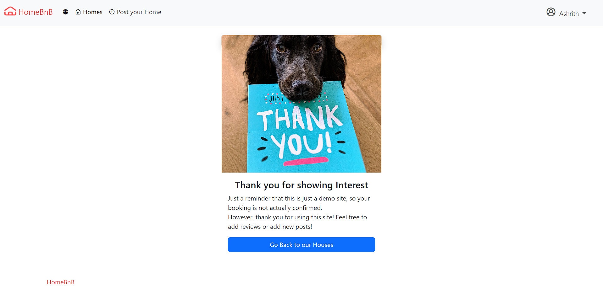

<h1>HomeBnB</h1>

<h2>About</h2>
This project is a full-stack web application that serves as a clone of Airbnb. It allows users to post homes for rent, leave reviews, and explore available rental options. The application includes CRUD (Create, Read, Update, Delete) functionality and features user authorization, login, and logout capabilities. The stack used for development includes HTML, CSS, Bootstrap, JavaScript, Node.js, Express.js, EJS (Embedded JavaScript), and MongoDB Atlas for the database. The application is deployed using the Render platform and integrates CI/CD (Continuous Integration/Continuous Deployment) practices.

<h2>Features</h2>
<ul>
<li>User authentication: Users can sign up, log in, and log out of the application. Only authorized users can post homes and leave reviews.
</li>
<li>Home posting: Users can create and post a home for rent, including details such as location, amenities, pricing, and availability.
</li>
<li>Review system: Users can leave reviews for homes they have stayed in, providing feedback and ratings.
</li>
<li>Map integration: The application includes map features, allowing users to view the location of homes on a map.
</li>
<li>CRUD functionality: Users can perform Create, Read, Update, and Delete operations on homes and reviews.
</li>
<li>RESTful API: The application follows RESTful API principles, enabling easy integration with external services and future scalability.
</li>
<li>Cloud data upload: The application supports uploading and storing images and other relevant data in the cloud for efficient data management.</li>
</ul>
<h2>Uploading Images</h2>

To upload images to the application, follow these steps:

Log in to the application with your authorized user account.
Navigate to the page where you can create a new home or update an existing one.
Look for an image upload field and click on it to select an image file from your device.
Submit the form to upload the image. The image will be stored in Cloudinary for future use.

<h2>Installation</h2>
<ol>
<li>Clone the repository: <code>git clone https://github.com/ashhh-01/HomeBnB.git</code></li>
<li>Navigate to the project directory Navigate to the project directory:<code> cd [Filename] </code>
</li>
<li>Install dependencies:<code>npm install</code>
</li>
<li>Set up MongoDB Atlas database. And run <code>node seeds/index.js</code></li>
<li>Set up a cloudinary, Mapbox, Unsplash developer accounts</li>
<li>Create a .env file in the project root and add the following variables:
</li>
    <ul>
    <li>CLOUDINARY_CLOUD_NAME</li>
    <li>CLOUDINARY_KEY</li>
    <li>CLOUDINARY_SECRET</li>
    <li>MAPBOX_TOKENS</li>
    <li>DB_URLATLAS</li> --Or Run it locally by connecting it to MongoDB
    <li>STOREKEY</li> -- Random Key
    </ul>
<li>Start the server:<code>npm start</code></li>
<li>Open your browser and visit http://localhost:3000\homebnb to access the application.</li>
</ol>
<h3>Dependencies</h3>
<ul>
<li>Node.js
</li>
<li>Express.js
</li>
<li>EJS</li>
<li>Bootstrap</li>
<li>Mongoose</li>
<li>Passport.js</li>
<li>Helmet</li>
<li>session</li>
<li>Other dependencies can be found in the package.json file.</li>
</ul>

<h2>Deployment</h2>

This application is deployed using the Render platform, which supports continuous integration and continuous deployment. Whenever changes are pushed to the main branch of the repository, Render automatically builds and deploys the updated version of the application.

Provide Render with all the necessary secrets

<h2>Screenshots</h2>

<h2>Thank you!</h2>

